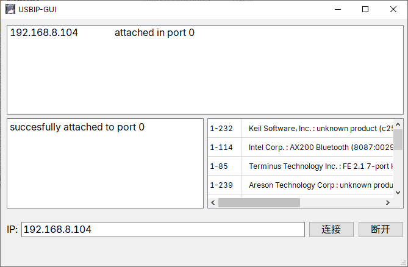
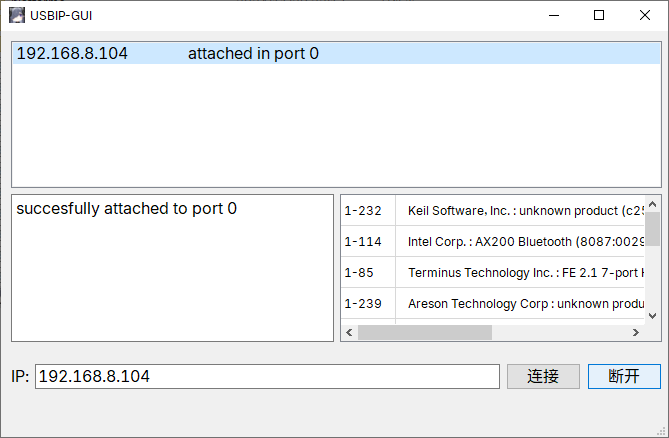
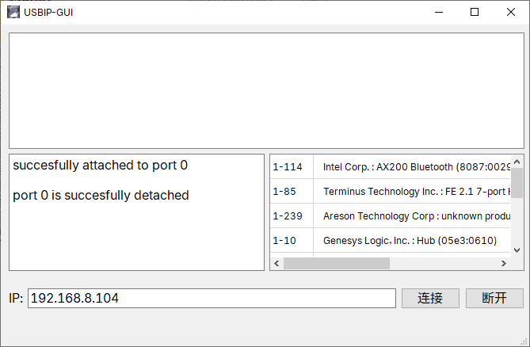

# 介绍
该项目只是一个建议的UI用于Windows的usbip，将网络设备附加到windows系统上

# 使用

## 在使用之前，请先安装USBIP-win，建议安装0.3.6版本或更高。

第一个框显示已经附加的USB设备，左边的框显示运行的日志，右边的框显示usbip list -l的设备。

在输入IP 后，点击链接，可以将你网络的USB设备附加到系统。

选中已经附加的设备，点击断开，则会取消附加。

# 致谢

[github@cezanne](https://github.com/cezanne) -> [usbip-win](https://github.com/cezanne/usbip-win)
